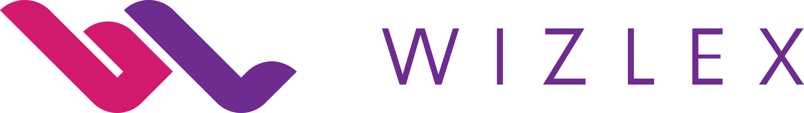

# Wizlex AI Toolkit

Make Wizlex-branded images, polished documents, and invoices by asking AI in plain English. **No coding knowledge is needed to use these skills.**

A **skill** is a reusable instruction pack that teaches an AI agent how to do a specific job. The **Wizlex Office plugin** bundles all three skills for **Codex and Claude Code**. Individual skill ZIPs can also be installed in **Cursor, GitHub Copilot, and other agents supporting the Agent Skills format**. Downloading a ZIP does not automatically install it in an ordinary chatbot conversation.

**Choose your app:** [Codex setup](#start-here--no-terminal-commands) · [Claude Code setup](#claude-code) · [Cursor, Copilot, and other agents](#cursor-github-copilot-and-other-agents)

## What can I make?

| Tool | Use it for | Try asking |
| --- | --- | --- |
| **Wizlex Branding** | Social posts, banners, presentation graphics, and other images with the real Wizlex logo | “Create a Wizlex LinkedIn image announcing our new service. Use the official logo.” |
| **Wizlex Document Format** | Proposals, reports, and Word documents using the Wizlex template | “Turn this outline into a Wizlex project proposal.” |
| **Wizlex Invoice Generator** | PDF invoices using billing details you provide privately | “Create a Wizlex invoice for this month's project work.” |

## Start here — no terminal commands

1. Open the **Codex desktop app** and start a new task.
2. Copy and paste this message:

   > Install the Wizlex Office plugin from https://github.com/wizlex-sieg/ai-skills for me. It includes Wizlex Branding, Wizlex Document Format, and Wizlex Invoice Generator. Use the repository's installation instructions, check for existing installations to avoid duplicates, and help me complete any required GitHub sign-in. Do not replace unrelated plugins or change repository visibility.

3. Follow any sign-in prompts shown by Codex. This repository is private, so your GitHub account needs access. If GitHub shows “404” or “Not Found,” ask the repository owner for access; you do not need to make the repository public. Never paste a password or access token into a chat.
4. Once Codex confirms installation, **start a new task** and try a prompt from the table above.

If you only want branding, paste this instead:

> Use the skill installer to install only wizlex-branding from https://github.com/wizlex-sieg/ai-skills/tree/main/plugins/wizlex-office/skills/wizlex-branding. Check whether it is already installed before making changes. Then tell me how to try it in a new task.

For documents, Codex can use its **Documents plugin**; other agents can use their document tools or the included portable workflow. Image creation needs an image or design tool available in your environment; the branding pack supplies the rules and logo, not an image-generation subscription. The invoice generator uses Python and ReportLab. Your agent can check which tools are available.

## Claude Code

Open Claude Code and enter these two commands, one at a time:

```text
/plugin marketplace add wizlex-sieg/ai-skills
/plugin install wizlex-office@wizlex-ai-skills
```

Complete the installation in Claude Code's plugin panel if prompted, then start a new session. Your GitHub account must have access to this private repository. Try: “Use the Wizlex Branding skill to create a LinkedIn banner with the official logo.”

Prefer asking the agent to handle setup? Paste:

> Install the Wizlex Office plugin from the wizlex-sieg/ai-skills GitHub repository using its Claude Code marketplace. Check for existing installations first, help me complete any required GitHub sign-in, and tell me which document and image tools are available. Do not replace unrelated plugins or change repository visibility.

The combined plugin ZIP contains both Codex and Claude Code manifests. For a downloaded and extracted plugin, technical users can load it locally with `claude --plugin-dir ./wizlex-office`. The repository's `.claude-plugin/marketplace.json` supplies the GitHub marketplace; it is separate from the plugin ZIP.

## Cursor, GitHub Copilot, and other agents

Download an individual skill ZIP below and extract the **whole skill folder**, including `assets`, `references`, and `scripts`. Copy it into the appropriate folder in the project where you want to use it:

| Agent | Project skill folder | Installation type |
| --- | --- | --- |
| Claude Code | `.claude/skills/` | Individual skill alternative to the plugin |
| Cursor | `.cursor/skills/` | Individual skills |
| GitHub Copilot | `.github/skills/` | Individual skills |
| Other Agent Skills-compatible agents | The location documented by that agent | Individual skills; discovery and tooling vary |

For example, Cursor should see `.cursor/skills/wizlex-branding/SKILL.md`, with the logo assets inside that same skill folder. Start a new agent session and ask it to use the skill by name. Codex's `$skill-name` spelling in optional UI metadata is not required in other agents; natural-language skill names work where the host supports skill discovery. `agents/openai.yaml` is optional Codex UI metadata, not a runtime dependency.

You can also ask your agent: “Install the three skills from `plugins/wizlex-office/skills` in https://github.com/wizlex-sieg/ai-skills into this project's supported skills folder. Preserve the complete folders and check for existing copies first.”

These packages provide instructions and assets. Each host still needs browsing for current brand verification, Python 3.10+ and ReportLab for invoice generation, and suitable editing/rendering tools for documents or images. An agent without image generation can still supply the official logo or prepare layout instructions. If it cannot browse or render, the skills require it to disclose that limitation rather than claim a verified result.

The manifests and portable folders are validated locally. Full end-to-end execution in Claude Code, Cursor, and Copilot has not been tested in this environment. Compatibility is based on their documented plugin/skill formats, not a claim that every host supplies the same tools.

Official setup references: [Claude Code marketplaces](https://code.claude.com/docs/en/plugin-marketplaces), [Claude Code plugin layout](https://code.claude.com/docs/en/plugins-reference), [Cursor skills](https://cursor.com/docs/skills), and [GitHub Copilot skills](https://docs.github.com/en/copilot/how-tos/copilot-on-github/customize-copilot/customize-cloud-agent/add-skills).

## Downloads and manual setup

Click a package below, then use GitHub's **Download raw file** button if it opens a file page. Extract the ZIP before installing it.

| Package | Download | Instructions |
| --- | --- | --- |
| All three skills as one plugin | [Wizlex Office ZIP](packages/wizlex-office.zip) | Ask Codex to install the plugin using the prompt above |
| Branding only | [Wizlex Branding ZIP](packages/wizlex-branding.zip) | [Read the skill](plugins/wizlex-office/skills/wizlex-branding/SKILL.md) |
| Documents only | [Wizlex Document Format ZIP](packages/artifact-template-wizlex-document-format.zip) | [Read the skill](plugins/wizlex-office/skills/artifact-template-wizlex-document-format/SKILL.md) |
| Invoices only | [Wizlex Invoice Generator ZIP](packages/wizlex-invoice-generator.zip) | [Read the skill](plugins/wizlex-office/skills/wizlex-invoice-generator/SKILL.md) |

To install an individual skill manually, put its extracted folder inside your Codex skills folder. With a standard setup, that is `%USERPROFILE%\.codex\skills` on Windows or `~/.codex/skills` on Mac. If you configured `CODEX_HOME`, use its `skills` folder instead. Create the folder if necessary. Each installed skill folder must directly contain `SKILL.md` and its supporting folders. Back up an existing copy before replacing it, then start a new task. Install either the plugin or the individual skills to avoid duplicates.

## The official Wizlex logo



- [Download the original SVG](plugins/wizlex-office/skills/wizlex-branding/assets/wizlex-logo-horizontal-color.svg) — best for design tools and sharp scaling.
- [Download the transparent PNG](plugins/wizlex-office/skills/wizlex-branding/assets/wizlex-logo-horizontal-color.png) — for apps that do not accept SVG.
- [Read the website-derived brand reference](plugins/wizlex-office/skills/wizlex-branding/references/brand-reference.md).

The SVG was downloaded unchanged from the logo used on [Wizlex's official website](https://www.wizlex.com/). The PNG is a direct conversion, not a recreated logo. The branding skill checks the website at the start of each asset task and reports when it cannot verify the current branding. It does not run a background monitor. Website observations are distinguished from suggested layout defaults; this pack is not a substitute for a formal brand manual.

For AI images, the skill creates the artwork and places the official logo afterward as an unchanged layer. It must never ask an image model to redraw the logo.

## Keep personal information private

The reusable invoice profile and document template contain placeholders. Provide actual names, contact details, addresses, and bank information only for the specific task, using private inputs outside this repository. Do not commit completed invoices or private profiles. Source documents, previews, and packaged archives have been sanitized.

## Installation details for Codex or technical helpers

With Codex CLI installed and Git authenticated to this repository:

```sh
codex plugin marketplace add https://github.com/wizlex-sieg/ai-skills.git
codex plugin add wizlex-office@personal
```

The repository's marketplace identifier is `personal`. If a different marketplace already uses that name, use the individual skill installation instead of replacing it. To use a local checkout, run `codex plugin marketplace add ./ai-skills` from its parent folder, then install `wizlex-office@personal`. The plugin ZIP contains the plugin; the repository also contains the marketplace manifest. Start a new task after installation or updates.

Canonical individual skill paths:

```text
plugins/wizlex-office/skills/wizlex-branding
plugins/wizlex-office/skills/artifact-template-wizlex-document-format
plugins/wizlex-office/skills/wizlex-invoice-generator
```

Invoice requirements, when not already present:

```sh
python -m pip install -r plugins/wizlex-office/skills/wizlex-invoice-generator/requirements.txt
```

The branding checker uses Python 3.10+ with no third-party packages:

```sh
python plugins/wizlex-office/skills/wizlex-branding/scripts/check_brand.py
```

It reports `unchanged`, `review_required`, or `unverified`; it never replaces files automatically. Website inspection is still required. See [official plugin packaging documentation](https://developers.openai.com/plugins/build/plugins) for the marketplace mechanism.

## Maintaining the toolkit

Edit the canonical sources in `plugins/wizlex-office/skills/`, then run:

```sh
python scripts/build_packages.py
```

This rebuilds the combined plugin ZIP, all individual skill ZIPs, and SHA-256 checksums in `packages/`. Python caches are excluded. When updating the brand assets, use the current official download, regenerate the PNG without altering the logo, and update the source URLs, hashes, and verification date in `assets/brand-source.json` inside the branding skill.
